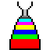
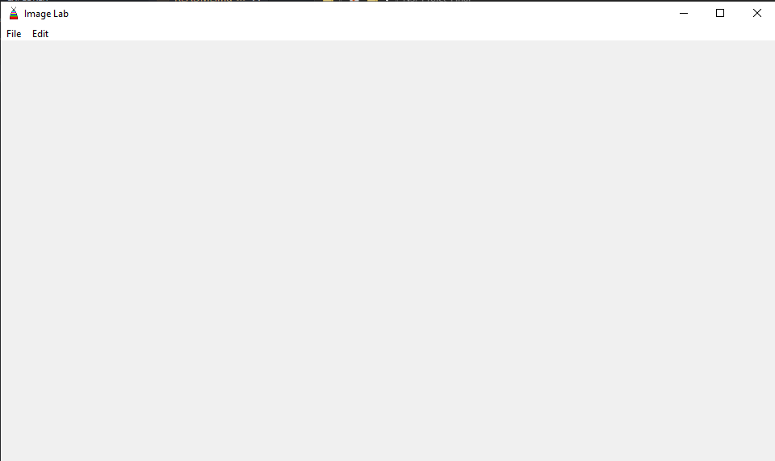
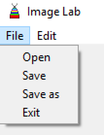
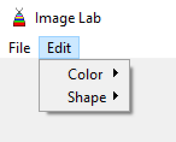

<h1>Image Lab</h1>

# Le Logiciel

Image Lab est un logiciel d'édition d'image développé avec le langage de programmation Python et les librairies PIL (Manipulation de l'image) et TKinter (Interface Graphique)

Le coeur a été entièrement développé par LTHCTheMaster (Lucas CHOSSY) et l'interface graphique a été pensé par algaunor (Maxime THIEBAUT) et l'implémentation de la liaison des fonctions au menu par LTHCTheMaster (Lucas CHOSSY)

Le logiciel intègre des options d'édition de couleur et de forme (menu: edit > color /// edit > shape)

Seul défaut, le logiciel ne supporte que des .jpg pour la raison simple du niveau de compression d'un fichier jpg étant supérieur à celui d'un png car à la base dédié au web, le logiciel ne supporte donc que le jpg pour éviter de saturer la RAM (mémoire vive)

/!\ Le logiciel peut prendre beaucoup de temps pour calculer sur des images de beaucoup plus grande taille, et donc le rendu prend plus de temps sur les plus grosses images, à savoir que l'affichage dans le petit cadre (le canvas) peut desfois être déformé

# L'Interface

# Menu
## File Menu

Open => ouvrir une image

Save => sauvegarder l'image actuellement ouverte

Save as => "sauvegarder sous" l'image actuellement ouverte

Exit => quitter le programme/logiciel

## Edit Menu

Color => Menu d'édition de couleur

Shape => Menu d'édition de forme
