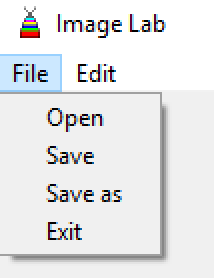

<h1>Image Lab</h1>

# Le Logiciel

Image Lab est un logiciel d'édition d'image développé avec le langage de programmation Python et les librairies PIL (Manipulation de l'image) et TKinter (Interface Graphique)

Le coeur a été entièrement développé par LTHCTheMaster (Lucas CHOSSY) et l'interface graphique a été pensé par algaunor (Maxime THIEBAUT) et l'implémentation de la liaison des fonctions au menu par LTHCTheMaster (Lucas CHOSSY)

# L'Interface

# Menu
## Edit Menu

