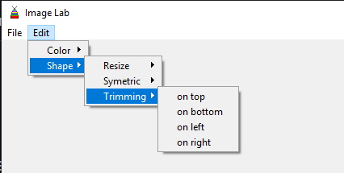

<div align="center">

<h1>Image Lab</h1>
</div>
<div align="left">
</div>

# Le Logiciel

Image Lab est un logiciel d'édition d'image développé avec le langage de programmation Python et les librairies PIL (Manipulation de l'image) et TKinter (Interface Graphique)

Le coeur a été entièrement développé par LTHCTheMaster (Lucas CHOSSY) et l'interface graphique a été pensé par algaunor (Maxime THIEBAUT) et l'implémentation de la liaison des fonctions au menu par LTHCTheMaster (Lucas CHOSSY)

Le logiciel intègre des options d'édition de couleur et de forme (menu: edit > color /// edit > shape)

Seul défaut, le logiciel ne supporte que des .jpg pour la raison simple du niveau de compression d'un fichier jpg étant supérieur à celui d'un png car à la base dédié au web, le logiciel ne supporte donc que le jpg pour éviter de saturer la RAM (mémoire vive)

/!\ Le logiciel peut prendre beaucoup de temps pour calculer sur des images de beaucoup plus grande taille, et donc le rendu prend plus de temps sur les plus grosses images, à savoir que l'affichage dans le petit cadre (le canvas) peut desfois être déformé

# L'Interface


# Menu
## File Menu


Open => ouvrir une image

Save => sauvegarder l'image actuellement ouverte

Save as => "sauvegarder sous" l'image actuellement ouverte

Exit => quitter le programme/logiciel

## Edit Menu


Color => Menu d'édition de couleur

Shape => Menu d'édition de forme

# Le menu d'édition de couleur


Negative => fait le négatif de l'image actuellement ouverte

Grey scale => fait le niveau de gris de l'image actuellement ouverte

Ignore Or Keep => Menu d'édition monocanal

Two Colors Median => Menu d'édition bicanal

Editing by Color Tables => Menu d'édition par palette de couleurs

## Ignore Or Keep


Ignore Red => met le canal rouge à 0 donc le désactive

Ignore Green => met le canal vert à 0 donc le désactive

Ignore Blue => met le canal bleu à 0 donc le désactive

Keep Red => met les canaux vert et bleu à 0 donc les désactive, il ne reste plus que le canal rouge

Keep Green => met les canaux rouge et bleu à 0 donc les désactive, il ne reste plus que le canal vert

Keep Blue => met les canaux rouge et vert à 0 donc les désactive, il ne reste plus que le canal bleu

## Two Colors Median


Red & Green Median => fait la moyenne du canal rouge et du canal vert du pixel et met cette moyenne dans le canal rouge et dans le canal vert du pixel

Red & Blue Median => fait la moyenne du canal rouge et du canal bleu du pixel et met cette moyenne dans le canal rouge et dans le canal bleu du pixel

Green & Blue Median => fait la moyenne du canal vert et du canal bleu du pixel et met cette moyenne dans le canal vert et dans le canal bleu du pixel

## Editing by Color Tables


Open Color Tables File => permet de charger une palette de couleur venant d'un fichier en .pctby

Exemple de fichier:
```
255;255;255
0;0;0
255;0;0
0;255;0
0;0;255
255;255;0
255;0;255
0;255;255
128;128;128
255;128;0
255;0;128
255;128;128
128;255;0
0;255;128
128;255;128
128;0;255
0;128;255
128;128;255
```

Run Editing => lance l'édition par palette de couleurs

# Le menu d'édition de forme


Resize => changement de taille

Symetric => menu pour faire de la symétrie

Trimming => menu pour faire du rognage

## Resize


by new width => demande une longueur et permet de retailler l'image proportionellement avec la nouvelle longueur

by new height => demande une hauteur et permet de retailler l'image proportionellement avec la nouvelle hauteur

by new width and height => demande une longueur et une hauteur et retaille l'image

by new scale => demande un ratio et permet de retailler l'image proportionellement avec le ratio

## Symetric


Horizontal symetry => fait la symétrie horizontale de l'image

Vertical symetry => fait la symétrie verticale de l'image

## Trimming


on top => demande une valeur et supprime la valeur ligne de pixel en haut de l'image

on bottom => demande une valeur et supprime la valeur ligne de pixel en bas de l'image

on left => demande une valeur et supprime la valeur colonne de pixel à gauche de l'image

on right => demande une valeur et supprime la valeur colonne de pixel à droite de l'image
